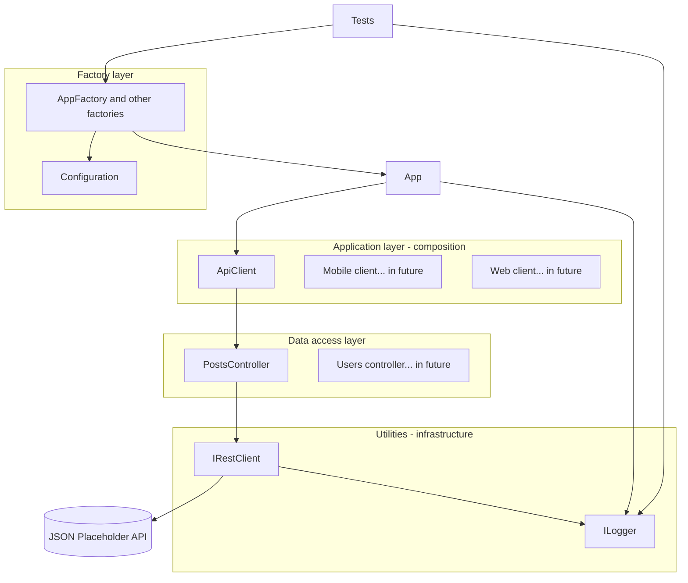

# IFSTestTask

REST API automated test framework setup for [JSONPlaceholder](https://jsonplaceholder.typicode.com) using **.NET**, **NUnit**, and **HttpClient**. Configuration is file-driven. Optional **Allure 3** reports are also supported.

## Prerequisites

- **[.NET SDK 10](https://dotnet.microsoft.com/download)** (project targets `net10.0`)
- **[Node.js](https://nodejs.org/en/download)** (LTS recommended)—required only if you generate **Allure 3** reports locally with `npx` (see below). Running `dotnet test` does not need Node.

## Run tests (command line)
To run tests use following commands

```bash
dotnet test     # runs tests
```

**Makefile** Serves as shortcut for test runs and report generation

```bash
make test       # runs tests
make report     # runs reporter on latest test results
make all        # runs tests and launches allure reporter
make clear      # clears all reports
```

## Configuration
Project features preset based test framework configuration
using config.json files in `IFSTests/TestConfigurations` folder

To run tests using specific config use environment variable **`IFS_TEST_CONFIG`** with the profile name (filename in `IFSTests/TestConfigurations/` without `.config.json`; e.g. **`default`**, **`debug`**).

Both configs use allure logger - both configs should be able to produce detailed allure reports but only `debug.config` writes steps to console

Project supports .env files and uses DotNetEnv.
Create .env file with variables or use commands to select configuration:

```bash
IFS_TEST_CONFIG=debug dotnet test
IFS_TEST_CONFIG=default dotnet test
```

Same for **Makefile** targets (variable applies to the child process):

```bash
IFS_TEST_CONFIG=debug make test
IFS_TEST_CONFIG=debug make all
```

when unset, **`default`** is used.

## Allure report (optional)

After a test run, results are under `IFSTests/bin/<Configuration>/net10.0/allure-results`.

Following command creates and shows report:

```bash
make report
```
for steps formatting in allure reports is responsible `AllureLogger`, so include this logger in configs to see detailed allure reports.

## Continuous integration

[`.github/workflows/test-and-report.yml`](.github/workflows/test-and-report.yml) runs tests on push and pull requests, builds an Allure report, uploads artifacts, and publishes the report to [GitHub Pages](https://yan-vi.github.io/IFSTestTask/) when on `main`.

**GitHub Actions repository variables** 
Workflow can be configured in continuous integration by manipulating following variables:

| Variable | Meaning | Default in continuous integration if unset |
|----------|---------|-------------------------|
| `IFS_TEST_CONFIG` | Same as local: basename of `IFSTests/TestConfigurations/{name}.config.json` | `debug` |
|`CONFIG`| test build configuration parameter, it is either `Release` or `Debug`| always `Release` |
| `VERBOSITY` | `dotnet test` log verbosity (e.g. `minimal`, `normal`, `detailed`) | `normal` |


## Architecture overview


